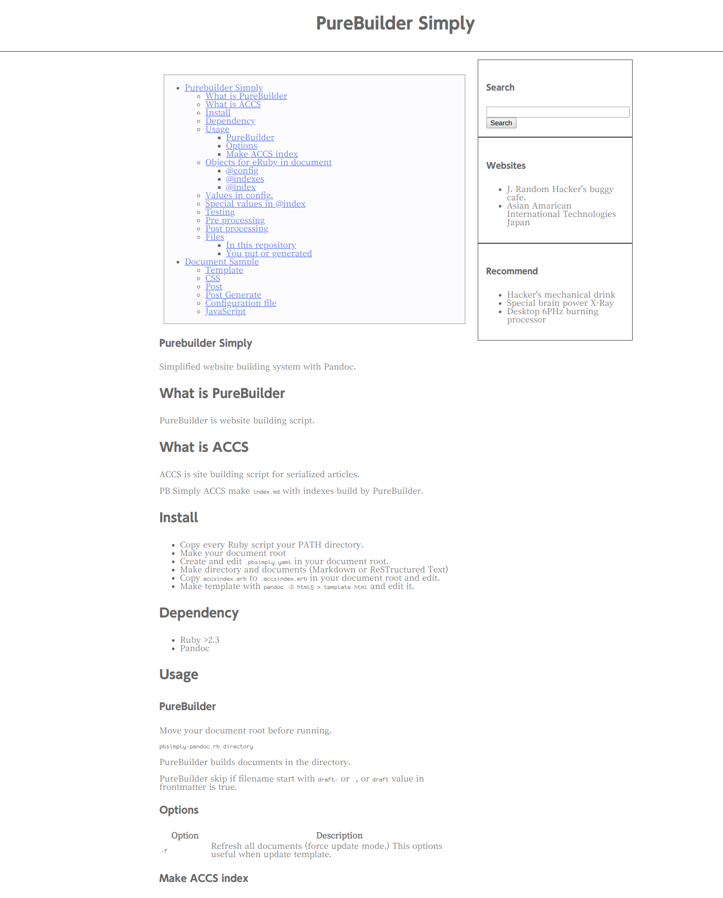
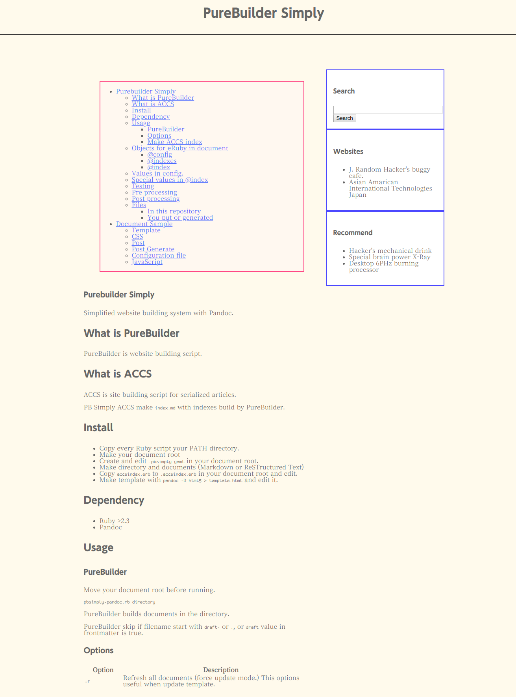
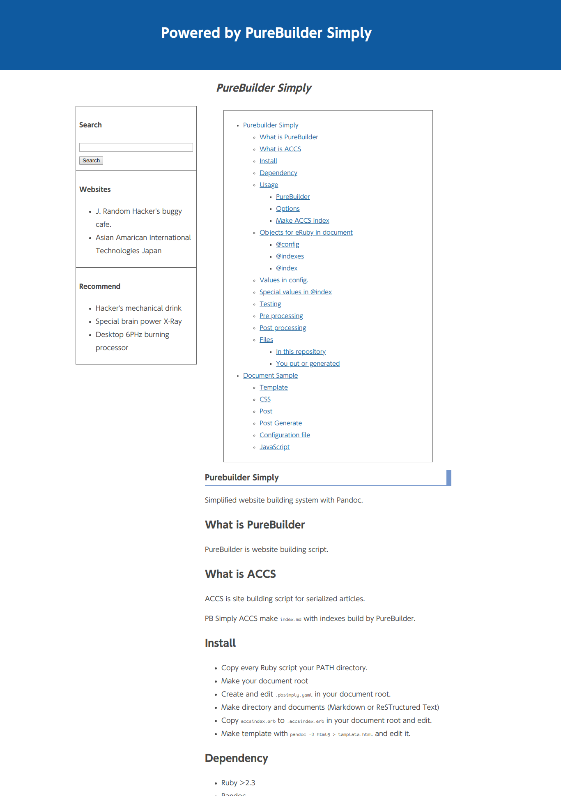

# Purebuilder Simply

簡素化されたPandocを使ったウェブサイト構築システム。

## PureBuilderとは

PureBuilder Simplyはウェブサイト構築スクリプトである。

## ACCSとは

ACCSはウェブサイト上で連載を構築するためのスクリプトである。

PureBuilder Simply ACCS はPureBuilder Simplyによって `index.html` ファイルを生成する。

## Install

* Rubyスクリプトを実行ディレクトリにコピーする
* ドキュメントルートディレクトリを作成する
* ドキュメントルートディレクトリに `.pbsimply.yaml`ファイルを設置する
* ディレクトリ及びドキュメント(MarkdownまたはReST)を書く
* `accsindex.erb`をドキュメントルートに`.accsindex.erb`として配置し、編集する
* `pandoc -D html5 > template.html` としてテンプレートファイルを作成し、編集する

## Dependency

* Ruby >= 2.3
* Pandoc >= 2.8

## Usage

### PureBuilder

ドキュメントルートに移動してから次のように実行する。

	pbsimply-pandoc.rb directory

PureBuilder Simplyはdirectoryにあるドキュメントを構築する。

構築されるドキュメントから除外したい場合、ファイル名を`draft-`または`.`ではじまるものにするか、
frontmatterの`draft`の値を真にする。

### Options

|オプション|内容|
|------|------------------------------|
|`-f`|すべてのドキュメントを強制的に更新する。テンプレートを更新した場合に便利|
|`-I`|`.indexes.rbm`に登録しない|
|`-o FILE`|出力ファイルをFILEに指定する|
|`-m FILE`|さらに追加のメタデータYAMLファイル|
|`-A`|ACCSモード (通常は使用しない)|

### Make ACCS index

ドキュメントルートに移動し、directory上のドキュメントを生成してから次のように実行する。

	pbsimply-accsindex.rb directory

PB Simply ACCS は `index.html`を生成する。

## eRubyで利用できるオブジェクト

テンプレートまたは生成されたドキュメントでeRubyを使うことができる。

eRubyでは次のオブジェクトが利用できる。

### @config

Loaded config YAML file (`.pbsimply.yaml`).

### @indexes

コンパイルされたインデックスデータベース。

このオブジェクトは`pbsimply-pandoc.rb`の途中で実行される場合、不完全である可能性が高い。

### @index

"default | indexed | frontmatter | current"にあるドキュメントメタデータ。

## 設定ファイルの値

|Key|Type|Description|
|-------|-----|---------------------|
|outdir|String|出力先ベースディレクトリ。必須|
|template|String|Pandoc HTMLテンプレートファイル。 `temaplte.html`がデフォルト|
|css|String / Array|CSSファイル|
|toc|Boolian|真ならばTOCを生成する|
|pandoc\_additional\_options|Array|追加で渡されるPandocのコマンドラインオプション|
|post\_eruby|Boolian|真にするとPandocの出力をerbによってプロセッシングする|
|alt\_frontmatter|Hash|ACCSインデックスファイルのデフォルトのfrontmatter|
|default\_meta|Hash|デフォルトのfrontmatter|
|testserver\_port|Fixnum|`pbsimply-testserver.rb`が使用するポート(default 8000)|
|self\_url\_prefix|String|生成されたドキュメントのURLの絶対パスのプレフィックス部。デフォルトは`/`|
|self\_url\_external\_prefix|String|`self_url_prefix`の`page_url_encoded_external`用|

## 特別な値

|Key|Set by|Used by|Description|
|-------|------------|------------|-----------------------------------|
|title|frontmatter|frontmatter|文書タイトル。必須|
|author|frontmatter|frontmatter|著者|
|date|frontmatter/system|frontmatter or system.|執筆日|
|lang|frontmatter|additional option / Pandoc template|`lang`/`xml:lang`|
|keywords|frontmatter|additional option / Pandoc template|An array, HTML metaタグのキーワードとして使うもの|
|description|frontmatter|additional option / Sample template|HTML metaタグのdescriptionとして使うもの|
|draft|frontmatter|additional option / system|草稿。真である場合プロセッシングから除外される|
|\_last\_proced|system|system|*Integer*. 最後にPureBuilderで処理された時刻。. はじめてのプロセッシングの場合(あるいはデータベースを削除した場合)`0`になる|
|last\_updated|system|system|*String*. 最後にPandocで生成した時刻|
|\_size|system|system|ファイルサイズ (byte)|
|\_mtime|system|system|*Integer*. mtime of this file.|
|\_filename|system|system|ファイル名|
|\_docformat|system|system|Document Format. `Markdown` or `ReST`.|
|categories|frontmatter|ACCS|ドキュメントのカテゴリ。ACCSによって使われる|
|pagetype|frontmatter/config|ACCS|ページタイプ。デフォルトは`post`。ACCSによって生成されるインデックスページは`accsindex`|
|accs\_order|config|ACCS|ACCSのドキュメントの並び。もし`desc`である場合、逆順に並べられる|
|blogmode|config|ACCS|ACCSのドキュメントの並び。真の時、降順に並べる|
|source\_directory|system|system|ソースディレクトリ|
|source\_file|system|system|ソースファイル名|
|source\_path|system|system|ソースファイルパス|
|page\_url|system|system|当該ドキュメントの生成後のURL|
|page\_url\_encoded|system|system|当該ドキュメントの生成後のURLのURIエンコードされたもの|
|page\_url\_encoded\_external|system|system|`page_url_encoded`で`self_url_external_prefix`を使うもの|
|title\_encoded|system|system|タイトルをURIエンコードしたもの|
|timestamp|frontmatter|frontmatter / system|`date`よりも詳細なドキュメントの日時を記載する項目|
|timestamp\_xmlschema|system|system|XMLスキーマでフォーマットされたドキュメント日時。`timestamp`が定義されていない場合、`date`を使う|
|timestamp\_jplocal|system|system|日本のローカル形式でフォーマットされたドキュメント日時。`timestamp`が定義されていない場合、`date`を使う|
|timestamp\_rubytimestr|system|system|Rubyの`Time#to_s`のようなフォーマットされたドキュメント日時。`timestamp`が定義されていない場合、`date`を使う|
|timestamp\_str|system||`%Y-%m-%d[ %H:%M:%S %Z]`形式の日時。 `timestamp`が定義されていない場合、`date`を使う|

## Testing

ドキュメント中のリンクはローカルな場所に **すべきではなく** 、 *web上のURLでなくてはいけない* 。
そのため生成したファイルを静的にテストすることはできない。

ドキュメントルートで`pbsimply-testserver.rb`を実行すると、テストサーバーを稼働させる。

使い方はとても簡単。

1. ドキュメントルートに移動する
2. 起動する
3. `http://localhost:port` にアクセスする

ポートは設定ファイルの`testserver_port`で設定でき、デフォルトは8000。

もし`http://example.com/site/index.html`のように本番環境がサブディレクトリにある場合、
ドキュメントをサブディレクトリ化に配置することを推奨する。

## 事前処理

`.pre_generate`ディレクトリ下にスクリプトを置くと、PureBuilder Simply Pandocは各ファイルの生成前に同スクリプトを実行する。

実行権限がなくてもshebangを理解するよう、スクリプトファイルは`perl`によって呼ばれる。

```
perl <script> <temporary_source_file>
```

PureBuilder Simply Pandocはtemporary_source_fileをこのスクリプトの出力で置き換える。

データベース構築より前に実行されるため、
スクリプトは`indexes.rbm`を利用することはできない。

ドキュメントメタデータは環境変数`$pbsimply_doc_frontmatter`で、YAML形式でアクセスできる。

ドキュメントのサブディレクトリ部分は環境変数`$pbsimply_subdir`でアクセスできる。

pre-scriptはドキュメントを生成する前に呼ばれ、スキップされる(更新されていない、あるいは草稿の)ドキュメントでは呼ばれない。

## 事後処理

`.post_generate`ディレクトリ下にスクリプトを置くと、PureBuilder Simply Pandocはファイルの生成後に同スクリプトを実行する。

実行権限がなくてもshebangを理解するよう、スクリプトファイルは`perl`によって呼ばれる。

```
perl <script> <temporary_source_file>
```

PureBuilder Simply Pandocは`temporary_source_file`をこのスクリプトの出力で置き換える。

スクリプトは`indexes.rbm`を利用することができ、該当するデータベースへのファイルパスは環境変数`$pbsimply_indexes`に格納される。

ドキュメントメタデータは環境変数`$pbsimply_doc_frontmatter`で、YAML形式でアクセスできる。

ドキュメントのサブディレクトリ部分は環境変数`$pbsimply_subdir`でアクセスできる。

post-scriptは生成されたファイルのリストとともに呼ばれる。
今回生成しなかった(既に生成されていた)ファイルはリストに含まれない。

## 祝福

`.pbsimply-bless.rb`というRubyスクリプトファイルを使うことでFrontmatterに手を加えることができる。

これを使用したい場合、同ファイルで`PureBuilder::BLESS` Procオブジェクトを定義する。
このオブジェクトは`PureBuilder::BLESS.call(frontmatter)`のように呼び出される。

呼び出されるタイミングは生成の直前であり、システムによってセットされる値も全てセットされた状態になる。

この関数は値を返す必要はなく、引数として渡されたFrontmatter Hashオブジェクトを直接変更できる。

## ファイル

### リポジトリに含まれるもの

|Filename|Description|
|--------|-------------|
|pbsimply-testserver.rb|テスト用ウェブサーバー起動スクリプト|
|accsindex.erb|`.accsindex.erb`のサンプル。通常編集せずそのまま利用できる|
|docroot-sample|(部分的に)コピーしてドキュメントルートとして使用するためのサンプル|
|postgenerate|post pluginsのサンプルファイル|

### あなたが置くか、生成されるもの

|ファイル名|場所|Description|
|--------|-----------|-------------|
|.pbsimply.yaml|root|設定ファイル。ドキュメントルートに置く|
|.indexes.rbm|each|PureBuilder Simplyが生成するRuby marshalファイル|
|.index.md|each|ACCSが生成するインデックスページ|
|.accsindex.erb|root or each ACCS|ACCSインデックスページ用Markdown eRubyテンプレート|
|.accs.yaml|each|ACCSインデックスページ用の`@index`|
|.post\_generate|root|post pluginsを配置するディレクトリ|
|.pre\_generate|root|pre pluginsを配置するディレクトリ|
|.pbsimply-bless.rb|root|Bless用のRubyスクリプト|

# ドキュメントサンプル

## テンプレート

このテンプレートは標準的なブログをイメージしたテーマとなっている。

* ふたつのヘッダーを持つ。通常は`display: none`になっているバナーのための`#TopHeader`と、タイトルのための`#TitleHeader`
* メインセクションは`#MainContainer` sectionで囲まれる
* 記事は`#MainArticle` articleに囲まれる
* サイドバーは`#SideBar` sectionとして容易されている。include beforeを使ってサイドバーの中身を書くことができる
* 著者部分は削除された
* 埋め込みCSSは削除された
* シンタックスハイライトのテーマも削除された。必要なら[pandoc-goodies](https://github.com/tajmone/pandoc-goodies)などで入手できる。

## CSS

基本的でシンプルなCSSが用意されている。

|ファイル|内容|
|---------|----------------|
|layout.css|レイアウト|
|base.css|最小限のデザイン|
|skylightning.css|PandocデフォルトのソースコードCSS|
|lightbox.css|Lightboxプラグインのテーマ|

## Post

ACCSのベースになるディレクトリ。

## Post Generate

post-pluginsのサンプルスクリプト

## 設定ファイル

`.accsindex.rb` と `.pbsimply.yaml` のサンプルファイルが用意されている。

## JavaScript

JavaScriptプラグインファイル。

それぞれのファイルにあるREADMEを読むこと。

## テーマ

コピーしたサンプルドキュメントディレクトリにテーマディレクトリをマージすることでテーマを利用することができる。

### Base



### Warm



### Practical


### Bloggy

]